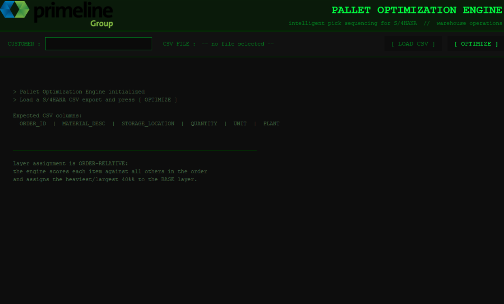
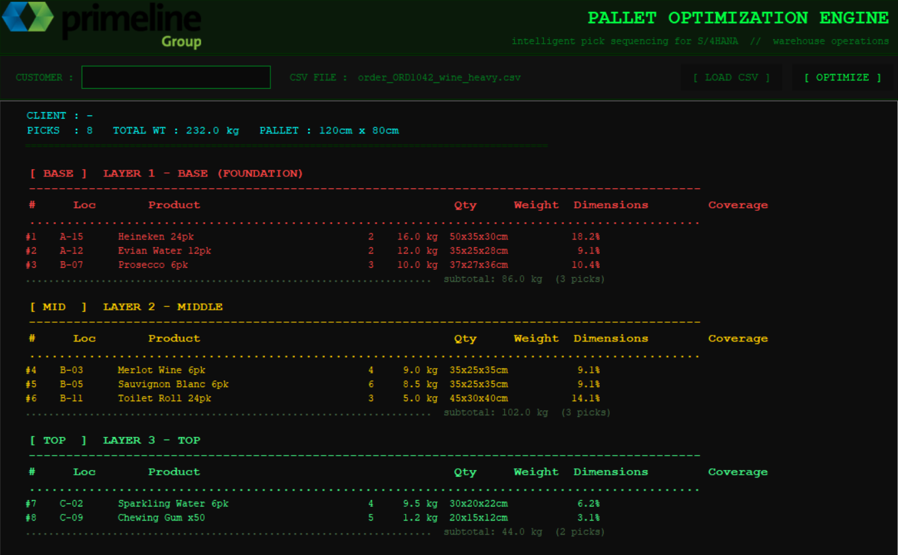

# Pallet Optimization Engine

> **Intelligent pick-sequence re-ordering for SAP S/4HANA warehouse operations.**
> Eliminates pallet rebuilds caused by weight-blind WMS sequencing — saving an estimated €25,000+ per warehouse per year.


---

## How It Works — Visual Walkthrough

### Step 1 — Open the app. Load your CSV file.



The engine starts ready. Click **[ LOAD CSV ]** to select your S/4HANA pick-order export, optionally enter a customer name, then press **[ OPTIMIZE ]**.

---

### Step 2 — Optimized pick sequence, grouped by pallet layer.



The engine re-sequences all picks into three color-coded layers:
- 🔴 **BASE** — heaviest items first (Heineken 16kg, Evian Water 12kg, Prosecco 10kg)
- 🟡 **MIDDLE** — medium weight (Merlot 9kg, Sauvignon Blanc 8.5kg, Toilet Roll 5kg)
- 🟢 **TOP** — lightest items last (Sparkling Water 9.5kg, Chewing Gum 1.2kg)

The picker follows this sequence and builds a stable pallet **first time, every time** — no rebuild needed.

---

## Table of Contents

1. [Executive Summary](#1-executive-summary)
2. [The Business Problem](#2-the-business-problem)
3. [Root Cause Analysis](#3-root-cause-analysis)
4. [The Solution](#4-the-solution)
5. [Business Case & ROI](#5-business-case--roi)
6. [System Architecture](#6-system-architecture)
7. [Data Flow](#7-data-flow)
8. [Optimization Algorithm](#8-optimization-algorithm)
9. [Product Catalog](#9-product-catalog)
10. [Installation & Usage](#10-installation--usage)
11. [CSV Format Specification](#11-csv-format-specification)
12. [Output Reference](#12-output-reference)
13. [S/4HANA Integration Roadmap](#13-s4hana-integration-roadmap)
14. [Project Background](#14-project-background)

---

## 1. Executive Summary

The **Pallet Optimization Engine** is a standalone desktop tool and Python CLI that re-sequences warehouse pick orders from SAP S/4HANA to follow optimal pallet-building logic — heaviest and largest items first, lightest items last.

The current WMS pick sequencer routes pickers by **warehouse location proximity only**, with no awareness of box weight or dimensions. This routinely results in unstable pallets that must be completely rebuilt mid-order — a process that doubles the physical handling of 50% of all boxes in an order and consumes 160+ minutes of productive labour per shift.

This tool solves the problem **without modifying SAP** — it operates as a pre-processing layer on the standard S/4HANA pick-order export and outputs an optimized pick sequence the picker can follow directly.

**Built by:** Manuel Ramos — based on direct operational observation at **Primeline Group, BOND unit**, Dublin.

---

## 2. The Business Problem

### 2.1 How SAP S/4HANA Sequences Picks Today

When a warehouse administrator creates a pick order in SAP S/4HANA, the system generates a pick sequence using **shortest-path routing** — it calculates an efficient walking route through the warehouse aisles to minimise travel distance. The picker receives each pick task one at a time on a handheld RF device and can only see their next location, never the full order at once.

**The system has zero awareness of:**
- Box weight (kg)
- Box dimensions (cm)
- Stacking constraints
- Pallet stability physics

### 2.2 What This Causes in Practice

The following scenario occurs multiple times per shift at Primeline BOND:

```
SAP PICK SEQUENCE (location-sorted):         RESULT ON PALLET:
─────────────────────────────────────────    ──────────────────────────────
Pick 1 → Aisle C: Chewing Gum x50  1.2kg    [Chewing Gum]      ← BOTTOM
Pick 2 → Aisle B: Wine 6pk         9.0kg    [Wine 6pk]
Pick 3 → Aisle A: Evian Water 12pk 12.0kg   [Evian Water]
Pick 4 → Aisle A: Heineken 24pk    16.0kg   [Heineken]         ← TOP
                                             PALLET COLLAPSES OR MUST BE REBUILT
```

The picker follows the system instructions correctly — the failure is entirely in the WMS logic, not human error.

### 2.3 Real-World Impact Observed at Primeline BOND

The following data was observed and recorded during operational time at the Primeline BOND warehouse unit:

| Order Type | Rebuilds per Shift | Minutes per Rebuild | Labour Lost per Shift |
|---|---|---|---|
| Wine orders | ~8 | ~20 min | **~160 minutes** |
| Beer orders | ~2–3 | ~20 min | ~50 minutes |
| Mixed ambient | ~1–2 | ~20 min | ~30 minutes |
| **Total** | **~12** | | **~240 minutes** |

### 2.4 The Hidden Cost Multiplier

A pallet rebuild is not just a 20-minute task. It forces the picker to **physically handle 50% of the boxes twice**:

```
Standard 100-box order:
  ├── Normal flow:   100 boxes handled  (1 touch per box)
  └── With rebuild:  150 boxes handled  (50 boxes touched twice)

Physical handling increase per rebuild:  +50%
Fatigue and injury risk increase:        Significant
```

---

## 3. Root Cause Analysis

| Layer | Root Cause |
|---|---|
| **Process** | Pick sequence is generated purely by location — no pallet-build awareness exists in the standard S/4HANA WMS configuration |
| **System** | SAP EWM/WM does support weight-based sequencing, but this requires configuration that has not been implemented in the current setup |
| **Operational** | Pickers receive tasks one at a time on RF devices — they cannot preview the full order and cannot self-correct until an unstable stack is already built |
| **Training** | No standard procedure exists for pickers to flag a problematic sequence before it causes a rebuild |

### 3.1 Why This Problem Is Worse for Wine and Beer

Wine and beer logistics involve a **high weight-variance order composition** — the same order typically contains 9 kg wine cases, 16 kg beer packs, and 1.2 kg chewing gum (ambient). This 15 kg spread between heaviest and lightest item in a single order is the primary driver of pallet instability when sequence is location-driven rather than weight-driven.

---

## 4. The Solution

### 4.1 Core Concept

Instead of routing the picker through aisles in location order, the engine routes them in **pallet-build order** — the picker collects items in the sequence that naturally builds a stable, layered pallet from the ground up, without any rearrangement.

```
OPTIMIZED PICK SEQUENCE:                     RESULT ON PALLET:
─────────────────────────────────────────    ──────────────────────────────
Pick 1 → Aisle A: Heineken 24pk    16.0kg   [Chewing Gum]      ← TOP
Pick 2 → Aisle A: Evian Water 12pk 12.0kg   [Wine 6pk]
Pick 3 → Aisle B: Wine 6pk         9.0kg    [Evian Water]
Pick 4 → Aisle C: Chewing Gum x50  1.2kg    [Heineken]         ← BASE
                                             PALLET IS STABLE. NO REBUILD.
```

The picker's walking route is slightly less optimal — but the elimination of rebuilds more than compensates for any additional travel distance.

### 4.2 Pallet Layer Logic

| Layer | Contents | Build Order | Visual |
|---|---|---|---|
| **Base (Layer 1)** | Heaviest and largest boxes relative to all items in the order | Picked first, placed on pallet floor | Foundation |
| **Middle (Layer 2)** | Medium weight and consistent dimensions | Picked after Base is fully placed | Stability layer |
| **Top (Layer 3)** | Lightest and smallest items, irregular shapes | Picked last, placed on top | Capping layer |

**Critical rule:** No heavy item may ever be placed above a light item, under any circumstance.

**Layer assignment is order-relative:** "Heavy" means heavy relative to all other items in this specific order. A 16 kg beer pack is always Base — but a 9 kg wine case might be Middle in a beer-heavy order or Base in a wine-only order. The algorithm adapts dynamically to each order's composition.

---

## 5. Business Case & ROI

### 5.1 Time Savings

| Metric | Per Shift | Per Day (2 shifts) | Per Year (250 days) |
|---|---|---|---|
| Wine order rebuilds eliminated | 8 × 20 min | 320 min | 1,333 hours |
| Beer order rebuilds eliminated | 2.5 × 20 min | 100 min | 417 hours |
| Mixed ambient rebuilds eliminated | 1.5 × 20 min | 60 min | 250 hours |
| **Total time recovered** | **~240 min** | **~480 min (8 hours)** | **~2,000 hours** |

### 5.2 Financial Impact (Single Warehouse)

| Cost Component | Calculation | Annual Value |
|---|---|---|
| Direct labour saved | 2,000 hrs × €12.50/hr | **€25,000** |
| Reduced physical handling (fatigue/injury reduction) | Qualitative | Significant |
| Pallet material waste (damaged wrap, collapsed loads) | ~€500/month | **€6,000** |
| Customer service (late/damaged orders due to collapses) | ~2 incidents/month | **€3,000–€8,000** |
| **Total estimated annual saving** | | **€34,000–€39,000** |

### 5.3 Implementation Cost

| Component | Cost |
|---|---|
| This proof-of-concept tool | €0 (open source) |
| SAP configuration (EWM weight-based sequencing) | €15,000–€40,000 one-time |
| Full S/4HANA RFC integration (production-grade) | €20,000–€50,000 one-time |
| **Payback period (SAP config route)** | **< 1 year** |
| **Payback period (this tool as interim solution)** | **Immediate** |

### 5.4 Scalability

This analysis covers a single warehouse unit. Primeline operates multiple distribution points. If the same rebuild pattern exists across 3 sites:

```
Annual saving potential:  3 × €25,000 = €75,000/year in labour alone
```

---

## 6. System Architecture

```
┌─────────────────────────────────────────────────────────────────────┐
│                     PALLET OPTIMIZATION ENGINE                      │
│                                                                     │
│  ┌──────────────┐    ┌──────────────┐    ┌──────────────────────┐  │
│  │   INPUT      │    │   CORE       │    │   OUTPUT             │  │
│  │   LAYER      │    │   ENGINE     │    │   LAYER              │  │
│  │              │    │              │    │                      │  │
│  │ csv_reader   │───▶│  optimizer   │───▶│  display (CLI)       │  │
│  │              │    │              │    │  app.py   (GUI)      │  │
│  │ manual_input │───▶│  catalog     │    │                      │  │
│  └──────────────┘    └──────────────┘    └──────────────────────┘  │
│                                                                     │
│  ┌─────────────────────────────────────────────────────────────┐   │
│  │  main.py  —  CLI entry point (argparse routing)             │   │
│  │  app.py   —  GUI entry point (tkinter desktop window)       │   │
│  └─────────────────────────────────────────────────────────────┘   │
└─────────────────────────────────────────────────────────────────────┘
```

### 6.1 Module Breakdown

| Module | Responsibility | Key Interfaces |
|---|---|---|
| `catalog.py` | Defines the `Product` dataclass and the 12-SKU reference catalog. Provides fuzzy name matching for legacy CSV imports. | `Product`, `get_product_by_name()`, `list_catalog()` |
| `optimizer.py` | Core algorithm: scores each pick line, assigns layers, sorts within layers. Produces `OptimizationResult`. | `optimize(picks, order_id, customer)` → `OptimizationResult` |
| `csv_reader.py` | Parses S/4HANA CSV exports. Supports both inline-dimension format (any product) and catalog-matched format. | `load_csv(filepath)` → `(picks, order_id, warnings)` |
| `manual_input.py` | Interactive terminal entry loop. Presents numbered catalog, collects product/qty/location. | `collect_order()` → `(picks, order_id)` |
| `display.py` | All terminal output — colored layer tables, summary block. No business logic. | `print_result(result)` |
| `main.py` | CLI entry point. Parses `--manual` / `--csv` / `--customer` flags and routes to the correct input mode. | Entry point |
| `app.py` | Desktop GUI entry point. tkinter window with Primeline branding, CSV file picker, colored results display. | Entry point (GUI / .exe) |

### 6.2 Design Principles

- **No business logic in the display layer** — `display.py` and `app.py` only format and render; all decisions are in `optimizer.py`
- **Stateless optimizer** — `optimize()` is a pure function: same input always produces same output, no side effects
- **Separation of input modes** — CSV and manual entry produce identical `List[PickLine]` objects; the optimizer does not know or care which source was used
- **Graceful degradation** — unknown products in CSV produce warnings, not failures; the engine runs on the valid rows it can find

---

## 7. Data Flow

```
S/4HANA Export (.csv)
        │
        ▼
  csv_reader.py
  ├── Read & normalise column names (case-insensitive)
  ├── If WEIGHT_KG / WIDTH_CM / DEPTH_CM / HEIGHT_CM present:
  │       └── Build Product inline from CSV data (any product name)
  └── Else:
          └── Fuzzy-match MATERIAL_DESC against catalog
        │
        ▼
  List[PickLine]
  (location, product, quantity, order_id, unit, plant)
        │
        ▼
  optimizer.py :: optimize()
  ├── Score each pick:
  │       score = 0.6 × norm_weight + 0.4 × norm_base_coverage
  ├── Sort descending by score
  ├── Assign layers by rank:
  │       top 40%  → BASE
  │       next 35% → MIDDLE
  │       last 25% → TOP
  ├── Within each layer: sort heaviest-first
  └── Compute: rearrangement_risk, stability_rating, time_saved
        │
        ▼
  OptimizationResult
        │
        ├──▶ display.py  (CLI colored output)
        └──▶ app.py      (GUI text widget rendering)
```

---

## 8. Optimization Algorithm

### 8.1 Scoring Function

Each pick line receives a composite score computed **relative to the other items in the same order**:

```
score = 0.6 × normalized_weight + 0.4 × normalized_base_coverage

where:
  normalized_weight   = (item_weight - min_weight) / (max_weight - min_weight)
  normalized_coverage = (item_footprint - min_footprint) / (max_footprint - min_footprint)
  item_footprint      = width_cm × depth_cm
```

**Why 60/40 weight-to-coverage?**
Weight is the primary driver of pallet instability — a heavy item on top of a light item will always collapse regardless of dimensions. Base coverage is secondary but matters for lateral stability on the pallet surface.

### 8.2 Layer Assignment

Items are sorted descending by score (rank 0 = highest score = heaviest/largest):

```python
if rank < total * 0.40:   → BASE   (top 40% by score)
if rank < total * 0.75:   → MIDDLE (next 35%)
else:                     → TOP    (bottom 25%)
```

Base receives a slightly larger allocation (40% vs 33%) because it is safer to over-assign items to the foundation layer than to risk placing a borderline-heavy item in the middle or top.

### 8.3 Rearrangement Risk Classification

After optimization, the engine computes what would have happened without it:

| Weight Range (max - min across order) | Risk Level | Meaning |
|---|---|---|
| ≥ 10 kg | HIGH | Near-certain rebuild under original WMS sequence |
| 4–10 kg | MEDIUM | Occasional rebuilds expected |
| < 4 kg | LOW | Homogeneous order — WMS sequence was probably fine |

---

## 9. Product Catalog

The built-in reference catalog covers the primary SKUs in BOND/ambient warehouse operations. It is used as a fallback when CSV files do not include inline dimension data.

| SKU | Product | Weight | W × D × H (cm) | Category |
|---|---|---|---|---|
| WTR-18L | Water Box 18L (6-pack) | 18.0 kg | 40 × 30 × 25 | Water |
| WTR-SPK | Sparkling Water 6-pack 1.5L | 9.5 kg | 30 × 20 × 22 | Water |
| BEE-24A | Beer 24-pack (Brand A) | 16.0 kg | 50 × 35 × 30 | Beer |
| BEE-24B | Beer 24-pack (Brand B) | 15.0 kg | 48 × 33 × 28 | Beer |
| BEE-24C | Beer 24-pack (Brand C) | 17.0 kg | 52 × 36 × 30 | Beer |
| WIN-RED | Wine 6-pack Red 75cl | 9.0 kg | 35 × 25 × 35 | Wine |
| WIN-WHT | Wine 6-pack White 75cl | 8.5 kg | 35 × 25 × 35 | Wine |
| WIN-ROS | Wine 6-pack Rose 75cl | 8.0 kg | 35 × 25 × 33 | Wine |
| WIN-SPK | Sparkling Wine 6-pack 75cl | 10.0 kg | 37 × 27 × 36 | Wine |
| TRL-24 | Toilet Roll 24-pack | 5.0 kg | 45 × 30 × 40 | Ambient |
| TRL-12 | Toilet Roll 12-pack | 2.5 kg | 35 × 25 × 30 | Ambient |
| GUM-BLK | Chewing Gum Bulk Box | 1.2 kg | 20 × 15 × 12 | Ambient |

---

## 10. Installation & Usage

### Requirements

- Python 3.10 or higher
- Windows / macOS / Linux

### Install Dependencies

```bash
pip install colorama pandas pillow
```

### Run the Desktop GUI (.exe — Windows only)

```
dist\PalletEngine.exe
```

Double-click to open. No Python installation required on the target machine.

### Run the CLI — CSV Mode

```bash
python main.py --csv order_ORD1042_wine_heavy.csv --customer "Tesco Ireland"
```

### Run the CLI — Manual Entry Mode

```bash
python main.py --manual
```

The tool will display a numbered product menu and prompt for product, quantity, and warehouse location for each pick line.

---

## 11. CSV Format Specification

### Format A — Full (Recommended)

Includes physical dimensions inline. Works with **any product name** — no catalog match required. This is the recommended format for production use.

```csv
ORDER_ID,MATERIAL_DESC,STORAGE_LOCATION,QUANTITY,UNIT,PLANT,WEIGHT_KG,WIDTH_CM,DEPTH_CM,HEIGHT_CM
ORD-1042,Heineken 24pk,A-15,2,EA,BOND,16.0,50,35,30
ORD-1042,Merlot Wine 6pk,B-03,4,EA,BOND,9.0,35,25,35
ORD-1042,Chewing Gum x50,C-09,5,EA,BOND,1.2,20,15,12
```

### Format B — Catalog-Matched (Legacy Fallback)

No dimension columns. Product names must partially match an entry in the built-in catalog.

```csv
ORDER_ID,MATERIAL_DESC,STORAGE_LOCATION,QUANTITY,UNIT,PLANT
4500123456,Beer 24-pack (Brand A),A-04,3,CS,IE01
4500123456,Wine 6-pack Red 75cl,B-12,8,CS,IE01
```

### Column Reference

| Column | Required | Type | Description |
|---|---|---|---|
| ORDER_ID | Yes | String | SAP sales or transfer order number |
| MATERIAL_DESC | Yes | String | Product description |
| STORAGE_LOCATION | Yes | String | Warehouse aisle/bin code (e.g. A-12) |
| QUANTITY | Yes | Integer | Number of cartons/boxes to pick |
| UNIT | No | String | Unit of measure (EA, CS, PAL) |
| PLANT | No | String | SAP plant/warehouse code |
| WEIGHT_KG | No* | Decimal | Gross weight per box in kilograms |
| WIDTH_CM | No* | Decimal | Box width on pallet surface (cm) |
| DEPTH_CM | No* | Decimal | Box depth on pallet surface (cm) |
| HEIGHT_CM | No* | Decimal | Box height / stacking direction (cm) |

*Required together for Format A. If any one is missing, the tool falls back to catalog matching.

---

## 12. Output Reference

### CLI Output

```
========================   PALLET OPTIMIZATION ENGINE   ========================

  Order ID  : ORD-1042
  Customer  : Tesco Ireland
  Picks     : 8
  Total Wt  : 232.0 kg
  Pallet    : 120cm x 80cm standard

  [BASE]  LAYER 1 - BASE (FOUNDATION)
  ==============================================================================
  #     Location  Product                  Qty    Weight   Dimensions   Coverage
  ------------------------------------------------------------------------------
  #1    A-15      Heineken 24pk              2   16.0 kg   50x35x30cm     18.2%
  #2    A-12      Evian Water 12pk           2   12.0 kg   35x25x28cm      9.1%
  #3    B-07      Prosecco 6pk               3   10.0 kg   37x27x36cm     10.4%

  [MID]   LAYER 2 - MIDDLE
  ...

  [TOP]   LAYER 3 - TOP
  ...

  SUMMARY
  Rearrangement risk  : HIGH  <- would have caused rebuild under WMS sequence
  Pallet stability    : GOOD
  Est. time saved     : ~20 minutes per order
```

### GUI Output

The desktop application renders the same data with color-coded layers:
- **Red** — BASE layer (heaviest items)
- **Yellow** — MIDDLE layer
- **Green** — TOP layer (lightest items)

Risk level is color-coded: red (HIGH), amber (MEDIUM), green (LOW).

---

## 13. S/4HANA Integration Roadmap

This tool currently operates as a **manual pre-processing step** — an admin exports from SAP, runs the tool, and provides the optimized sequence to the picker team. The following roadmap describes how it could be fully integrated into the SAP pick workflow:

### Phase 1 — Current (Proof of Concept)
- Admin exports CSV from S/4HANA transaction LT0A / VL06O
- Runs `PalletEngine.exe`, enters customer name, loads CSV
- Prints or shares the optimized pick sheet with pickers
- **Investment:** Zero. This tool as-is.

### Phase 2 — Semi-Automated (3–6 months)
- Scheduled export from S/4HANA to a shared network folder
- PalletEngine runs automatically, outputs PDF pick sheets
- Pickers receive optimized paper sheets at shift start
- **Investment:** ~20 hours development. Batch script + PDF output module.

### Phase 3 — SAP EWM Configuration (6–12 months)
- Enable weight-based pick sequencing in SAP Extended Warehouse Management
- Configure handling unit rules in WM/EWM to enforce layer logic natively
- Pickers receive pre-optimized tasks on RF handhelds — no external tool needed
- **Investment:** SAP consultant engagement. ~€15,000–€40,000.

### Phase 4 — RFC / BAPI Integration (12+ months)
- Python RFC client (`pyrfc`) pulls open orders directly from SAP via BAPI_GOODSMVT_GETITEMS or custom BAPI
- Optimized sequence is written back to SAP as a custom pick sequence
- Full audit trail within SAP — no CSV export step
- **Investment:** ~€20,000–€50,000 including testing and UAT.

---

## 14. Project Background

This project was built based on **direct personal observation** working operationally in the Primeline Group BOND warehouse unit in Dublin, Ireland.

The pallet rebuild problem was not identified through data analysis or management reporting — it was observed on the warehouse floor, timing rebuilds, counting box touches, and speaking with pickers who had normalised the extra work as part of their daily routine.

The core insight is simple: **the problem is entirely in the sequence, not in the people, the products, or the warehouse layout.** SAP generates a technically correct route but an operationally incorrect build order. Changing the sequence — without changing anything else — eliminates the problem entirely.

This tool is a proof of concept demonstrating that the solution exists, is implementable in Python in under 1,000 lines of code, and produces quantifiably correct output. The business case for a full SAP integration is clear.

---

## Tech Stack

| Component | Technology | Reason |
|---|---|---|
| Language | Python 3.10+ | Cross-platform, fast to iterate, strong data libraries |
| Terminal colors | colorama | Cross-platform ANSI color (Windows CMD / PowerShell safe) |
| CSV parsing | pandas | Robust handling of S/4HANA export edge cases |
| Desktop GUI | tkinter | Zero external dependency, ships with Python |
| Image handling | Pillow | PNG logo rendering in tkinter |
| .exe packaging | PyInstaller | Single-file Windows executable, no Python install needed |
| Core logic | Python stdlib only | dataclasses, pathlib, argparse — no framework lock-in |

---

## License

MIT License — free to use, modify, and distribute.

---

*Built by Manuel Ramos · Primeline Group BOND, Dublin · 2025*
*Proof of concept for SAP S/4HANA pick-order optimization*
